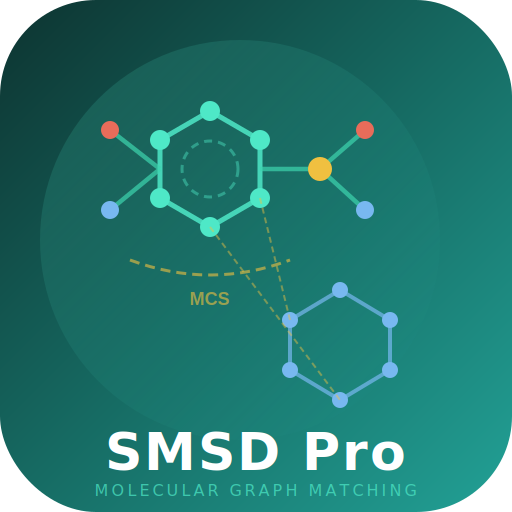

<p align="center">
  <a href="https://github.com/asad/SMSD" aria-label="SMSD Pro">
    
  </a>
</p>

<h1 align="center">SMSD Pro</h1>
<p align="center"><strong>Substructure &amp; MCS Search for Chemical Graphs</strong></p>

<p align="center">
  <a href="https://central.sonatype.com/artifact/com.bioinceptionlabs/smsd"></a>
  <a href="https://pypi.org/project/smsd/"></a>
  <a href="https://pypi.org/project/smsd/"></a>
  <a href="LICENSE"></a>
  <a href="https://github.com/asad/SMSD/releases"></a>
</p>

---

SMSD Pro provides exact substructure search and maximum common substructure
(MCS) search for chemical graphs. It is available for **Java**, **C++**
(header-only), and **Python**. Optional GPU paths are available for CUDA and
Apple Metal builds.

The `6.10.2` line improves Python bindings, strengthens aromaticity
perception for Kekule and fused-ring systems, and tightens matching
reliability across the native and Java-aligned paths.

User guides:
- [Python guide](docs/PYTHON.md)
- [Java guide](docs/JAVA.md)
- [C++ guide](docs/CPP.md)
- [Optimization roadmap](docs/OPTIMIZATION_ROADMAP.md)

Native molfile scope in 6.10.2:
- supported: V2000 and V3000 core graph round-trip, names/comments, SDF properties, charges, isotopes, atom classes/maps, `R#` plus `M  RGP`, and basic stereo flags
- not yet implemented as full native query chemistry: the more exotic MDL query atom/bond semantics such as full atom lists, variable attachment/query bonds, link nodes, and the complete Markush feature set

**Copyright (c) 2018-2026 Syed Asad Rahman — BioInception PVT LTD**

---

## Install

### Java (Maven)

```xml
<dependency>
  <groupId>com.bioinceptionlabs</groupId>
  <artifactId>smsd</artifactId>
  <version>6.10.2</version>
</dependency>
```

### Java (Download JAR)

```bash
curl -LO https://github.com/asad/SMSD/releases/download/v6.10.2/smsd-6.10.2-jar-with-dependencies.jar

java -jar smsd-6.10.2-jar-with-dependencies.jar \
  --Q SMI --q "c1ccccc1" --T SMI --t "c1ccc(O)cc1" --json -
```

### Python (pip)

```bash
pip install smsd
```

Supported CPython versions: `3.9` through the latest stable release series.
Current default test target: `Python 3.12`.
CPU execution is the default path. CUDA and Metal acceleration are optional.
RDKit and Open Babel are optional interop layers.

```python
import smsd

result = smsd.substructure_search("c1ccccc1", "c1ccc(O)cc1")
mcs    = smsd.mcs("c1ccccc1", "c1ccc2ccccc2c1")

# Tautomer-aware MCS
mcs    = smsd.mcs("CC(=O)C", "CC(O)=C", tautomer_aware=True)

# Prefer rare heteroatoms (S, P, Se) for reaction mapping
mcs    = smsd.mcs("C[S+](C)CCC(N)C(=O)O", "SCCC(N)C(=O)O",
                   prefer_rare_heteroatoms=True)

# Reaction-aware atom mapping
aam    = smsd.map_reaction_aware("CC(=O)O", "CCO")

# Similarity upper bound (fast pre-filter)
sim    = smsd.similarity("c1ccccc1", "c1ccc(O)cc1")

fp     = smsd.fingerprint("c1ccccc1", kind="mcs")

# Circular fingerprint (ECFP4 equivalent, tautomer-aware)
ecfp4 = smsd.circular_fingerprint("c1ccccc1", radius=2, fp_size=2048)
```

### Java API

```java
import com.bioinception.smsd.core.*;

SMSD smsd = new SMSD(mol1, mol2, new ChemOptions());
boolean isSub = smsd.isSubstructure();
var mcs = smsd.findMCS();

// Reaction-aware with bond-change scoring
SearchEngine.McsOptions opts = new SearchEngine.McsOptions();
opts.reactionAware = true;
opts.bondChangeAware = true;  // penalise implausible bond transformations
var rxnMcs = SearchEngine.reactionAwareMCS(g1, g2, new ChemOptions(), opts);

// CIP stereo assignment (Rules 1-5, including pseudoasymmetric r/s)
Map<Integer, Character> stereo = CipAssigner.assignRS(g);
Map<Long, Character> ez = CipAssigner.assignEZ(g);

// Batch MCS with non-overlap constraints
var mappings = SearchEngine.batchMcsConstrained(queries, targets, new ChemOptions(), 10_000);
```

### Python — Advanced Features

```python
import smsd

# --- Reaction-Aware MCS ---
# Prefer heteroatom-containing mappings for reaction center identification
mapping = smsd.map_reaction_aware(
    "C[S+](CCC(N)C(=O)O)CC1OC(n2cnc3c(N)ncnc32)C(O)C1O",  # SAM
    "SCCC(N)C(=O)OCC1OC(n2cnc3c(N)ncnc32)C(O)C1O"           # SAH
)

# --- Structured MCS Result ---
result = smsd.mcs_result("c1ccccc1", "c1ccc(O)cc1")
print(result.size)          # 6
print(result.tanimoto)      # 0.857
print(result.mcs_smiles)    # "c1ccccc1"
print(result.mapping)       # {0: 0, 1: 1, ...}

# --- Works with any input type ---
# SMILES strings
mcs = smsd.mcs("c1ccccc1", "c1ccc(O)cc1")

# MolGraph objects (pre-parsed, fastest for batch)
g1 = smsd.parse_smiles("c1ccccc1")
g2 = smsd.parse_smiles("c1ccc(O)cc1")
mcs = smsd.mcs(g1, g2)

# Native Mol objects (auto-detected, indices returned in native ordering)
# from rdkit import Chem
# mcs = smsd.mcs(Chem.MolFromSmiles("c1ccccc1"), Chem.MolFromSmiles("c1ccc(O)cc1"))

# --- Fingerprints ---
ecfp4  = smsd.circular_fingerprint("c1ccccc1", radius=2, fp_size=2048)
fcfp4  = smsd.circular_fingerprint("c1ccccc1", radius=2, fp_size=2048, mode="fcfp")
counts = smsd.ecfp_counts("c1ccccc1", radius=2, fp_size=2048)
torsion = smsd.topological_torsion("c1ccccc1", fp_size=2048)
tan    = smsd.tanimoto(ecfp4, ecfp4)

# --- 2D Layout ---
g = smsd.parse_smiles("c1ccc2c(c1)cc1ccccc1c2")  # phenanthrene
coords = smsd.force_directed_layout(g, max_iter=500, target_bond_length=1.5)
coords = smsd.stress_majorisation(g, max_iter=300)
crossings = smsd.reduce_crossings(g, coords, max_iter=2000)
```

### Python — MCS Variants & Batch Operations

```python
import smsd

# --- All MCS variants ---
mcs = smsd.mcs("c1ccccc1", "c1ccc(O)cc1")                     # Connected MCS (default)
mcs = smsd.mcs("c1ccccc1", "c1ccc(O)cc1", connected_only=False) # Disconnected MCS
mcs = smsd.mcs("c1ccccc1", "c1ccc(O)cc1", induced=True)         # Induced MCS
mcs = smsd.mcs("c1ccccc1", "c1ccc(O)cc1", maximize_bonds=True)  # Edge MCS (MCES)

# Find top-N distinct MCS solutions
all_mcs = smsd.find_all_mcs("c1ccccc1", "c1ccc(O)cc1", max_results=5)

# SMARTS-based MCS
mcs = smsd.find_mcs_smarts("[#6]~[#7]", "c1ccc(N)cc1")

# Scaffold MCS (Murcko framework)
scaffold = smsd.find_scaffold_mcs("CC(=O)Oc1ccccc1C(=O)O", "Oc1ccccc1C(=O)O")

# R-group decomposition
rgroups = smsd.decompose_r_groups("c1ccccc1", ["c1ccc(O)cc1", "c1ccc(N)cc1"])

# --- Substructure Search ---
hit = smsd.substructure_search("c1ccccc1", "c1ccc(O)cc1")
all_matches = smsd.find_all_substructures("c1ccccc1", "c1ccc(O)cc1", max_matches=10)

# SMARTS pattern matching
matches = smsd.smarts_search("[OH]", "c1ccc(O)cc1")

# --- Similarity & Screening ---
sim = smsd.tanimoto(
    smsd.circular_fingerprint("CCO", radius=2),
    smsd.circular_fingerprint("CCCO", radius=2)
)
dice = smsd.dice_similarity(
    smsd.ecfp_counts("CCO", radius=2),
    smsd.ecfp_counts("CCCO", radius=2)
)

# --- Chemistry Options ---
# Tautomer-aware with solvent and pH
mcs = smsd.mcs("CC(=O)C", "CC(O)=C",
               tautomer_aware=True, solvent="DMSO", pH=5.0)

# Loose bond matching (FMCS-style)
mcs = smsd.mcs("c1ccccc1", "C1CCCCC1", bond_order_mode="loose")

# --- Canonical SMILES ---
smi = smsd.canonical_smiles("OC(=O)c1ccccc1")   # deterministic canonical form
mcs_smi = smsd.mcs_to_smiles(g1, mapping)        # extract MCS as SMILES

# --- CIP Stereo Assignment ---
g = smsd.parse_smiles("N[C@@H](C)C(=O)O")  # L-alanine
stereo = smsd.assign_rs(g)                   # {1: 'S'}
ez = smsd.assign_ez(smsd.parse_smiles("C/C=C/C"))  # E-2-butene

# --- Native MolGraph I/O ---
g = smsd.parse_smiles("c1ccccc1")
g = smsd.read_molfile("molecule.mol")
mol_block = smsd.write_mol_block(g)
v3000 = smsd.write_mol_block_v3000(g)
smsd.write_molfile(g, "molecule_out.mol", v3000=True)
smsd.export_sdf([g1, g2], "output.sdf")
```

### Export & Depiction

```python
import smsd

# Depict MCS with highlighted atoms (works in Jupyter)
img = smsd.depict_mcs("c1ccccc1", "c1ccc(O)cc1")
img.save("mcs.png")

# Depict substructure match
img = smsd.depict_substructure("c1ccccc1", "c1ccc(O)cc1")

# Generate SVG
svg = smsd.to_svg("c1ccccc1")

# Export to SDF file
mols = [smsd.parse_smiles(s) for s in ["CCO", "c1ccccc1", "CC(=O)O"]]
smsd.export_sdf(mols, "output.sdf")
```

### C++ (Header-Only)

```bash
git clone https://github.com/asad/SMSD.git
# Add SMSD/cpp/include to your include path — no other dependencies needed
```

```cpp
#include "smsd/smsd.hpp"

auto mol1 = smsd::parseSMILES("c1ccccc1");
auto mol2 = smsd::parseSMILES("c1ccc(O)cc1");

bool isSub = smsd::isSubstructure(mol1, mol2, smsd::ChemOptions{});
auto mcs   = smsd::findMCS(mol1, mol2, smsd::ChemOptions{}, smsd::McsOptions{});

// Bond-change-aware MCS for reaction mapping
auto opts = smsd::McsOptions{};
opts.reactionAware = true;
opts.bondChangeAware = true;
auto rxnMcs = smsd::reactionAwareMCS(mol1, mol2, smsd::ChemOptions{}, opts);

// Batch MCS with non-overlap constraints (multi-fragment reactions)
auto mappings = smsd::batchMcsConstrained(queries, targets, smsd::ChemOptions{});
```

### Build from Source

```bash
git clone https://github.com/asad/SMSD.git
cd SMSD

# Java
mvn -U clean package

# C++
mkdir cpp/build && cd cpp/build
cmake .. -DCMAKE_BUILD_TYPE=Release
make -j$(nproc)

# Python
cd python && pip install -e .
```

### Docker

```bash
docker build -t smsd .
docker run --rm smsd --Q SMI --q "c1ccccc1" --T SMI --t "c1ccc(O)cc1" --json -
```

---

## Benchmarks

### MCS Performance (Python)

Representative pairs from the checked-in Python benchmark results on the same
machine and in the same Python process.
Full data: [`benchmarks/results_python.tsv`](benchmarks/results_python.tsv)
For the maintained local core leaderboard, run `python3 benchmarks/benchmark_leaderboard.py --mode core --compare-mode strict`.
Use the mode-matched core leaderboard for current cross-tool comparisons.

| Pair | Category | SMSD (ms) | MCS Size |
|---|---|---:|---:|
| Cubane (self) | Cage | 0.003 | 8 |
| Coronene (self) | PAH | 0.006 | 24 |
| NAD / NADH | Cofactor | 0.012 | 44 |
| Caffeine / Theophylline | N-methyl diff | 0.017 | 13 |
| Morphine / Codeine | Alkaloid | 0.079 | 20 |
| Ibuprofen / Naproxen | NSAID | 0.070 | 15 |
| ATP / ADP | Nucleotide | 0.148 | 27 |
| PEG-12 / PEG-16 | Polymer | 0.039 | 40 |
| Paclitaxel / Docetaxel | Taxane | 1,691 | 56 |

### Substructure Performance (Java)

Current maintained cached Java core summary:
**28/28 hit agreement** and **28/28 speed wins vs CDK** on the local curated corpus.

Run `python3 benchmarks/benchmark_leaderboard.py --mode core --compare-mode strict`
to refresh the maintained local summary.

### External Benchmark Datasets

Community-standard datasets for reproducible evaluation, stored in [`benchmarks/data/`](benchmarks/data/):

| Dataset | Pairs/Patterns | Source | Purpose |
|---------|---------------|--------|---------|
| Tautobase (Chodera subset) | 468 tautomer pairs | [Wahl & Sander 2020](https://doi.org/10.1021/acs.jcim.0c00035) | Tautomer-aware MCS validation |
| Tautobase (full SMIRKS) | 1,680 pairs | [Wahl & Sander 2020](https://doi.org/10.1021/acs.jcim.0c00035) | Tautomer transform coverage |
| Ehrlich-Rarey SMARTS v2.0 | 1,400 patterns | [Ehrlich & Rarey 2012](https://doi.org/10.1186/1758-2946-4-13) | Substructure search validation |
| Dalke-style random pairs | 1,000 pairs | MoleculeNet drug collections | Low-similarity MCS scaling |
| Dalke-style NN pairs | 1,000 pairs | MoleculeNet drug collections | High-similarity MCS quality |
| Stress pairs | 12 pairs | Duesbury et al. 2017 | Timeout/robustness |
| Molecule pool | 5,590 SMILES | MoleculeNet (BBBP, SIDER, ClinTox, BACE) | Pair generation source |

```bash
# Run external benchmarks (Java)
mvn test -Dtest=ExternalBenchmarkTest -Dbenchmark=true

# Run external benchmarks (Python)
SMSD_BENCHMARK=1 pytest python/tests/test_external_benchmarks.py -v -s

# Regenerate Dalke-style pairs (requires RDKit)
python benchmarks/generate_dalke_pairs.py
```

---

## Algorithms

### MCS Pipeline (11-level funnel)

| Level | Algorithm | Based on |
|---|---|---|
| L0 | Label-frequency upper bound | Degree-aware coverage-driven termination |
| L0.25 | Chain fast-path | O(n*m) DP for linear polymers (PEG, lipids) |
| L0.5 | Tree fast-path | Kilpelainen-Mannila DP for branched polymers (dendrimers, glycogen) |
| L0.75 | Greedy probe | O(N) fast path for near-identical molecules |
| L1 | Substructure containment | VF2++ check if smaller molecule is subgraph |
| L1.25 | Augmenting path extension | Forced-extension bond growth from substructure seed |
| L1.5 | Seed-and-extend | Bond-growth from rare-label seeds |
| L2 | McSplit + RRSplit | Partition refinement (McCreesh 2017) with maximality pruning |
| L3 | Bron-Kerbosch | Product-graph clique with Tomita pivoting + k-core + orbit pruning |
| L4 | McGregor extension | Forced-assignment bond-grow frontier (McGregor 1982) |
| L5 | Extra seeds | Ring skeleton, heavy-atom core, label-degree anchor seeds |

### MCS Variants

| Variant | Flag |
|---|---|
| MCIS (induced) | `induced=true` |
| MCCS (connected) | default |
| MCES (edge subgraph) | `maximizeBonds=true` |
| dMCS (disconnected) | `disconnectedMCS=true` |
| N-MCS (multi-molecule) | `findNMCS()` |
| Weighted MCS | `atomWeights` |
| Scaffold MCS | `findScaffoldMCS()` |
| Tautomer-aware MCS | `ChemOptions.tautomerProfile()` |

### Substructure Search (VF2++)

VF2++ (Juttner & Madarasi 2018) with FASTiso/VF3-Light matching order, 3-level NLF pruning, bit-parallel candidate domains, and GPU-accelerated domain initialization (CUDA + Metal).

### Ring Perception

Horton's candidate generation + 2-phase GF(2) elimination (Vismara 1997) for relevant cycles, orbit-based grouping for Unique Ring Families (URFs).

| Output | Description |
|---|---|
| SSSR / MCB | Smallest Set of Smallest Rings |
| RCB | Relevant Cycle Basis |
| URF | Unique Ring Families (automorphism orbit grouping) |

---

## Chemistry Options

| Option | Values |
|---|---|
| Chirality | R/S tetrahedral, E/Z double bond |
| Isotope | `matchIsotope=true` |
| Tautomers | 15 transforms with pKa-informed weights (Sitzmann 2010) |
| Solvent | AQUEOUS, DMSO, METHANOL, CHLOROFORM, ACETONITRILE, DIETHYL_ETHER |
| Ring fusion | IGNORE / PERMISSIVE / STRICT |
| Bond order | STRICT / LOOSE / ANY |
| Aromaticity | STRICT / FLEXIBLE |
| Lenient SMILES | `ParseOptions{.lenient=true}` (C++) / `ChemOptions.lenientSmiles` (Java) |

**Preset profiles**: `ChemOptions()` (default), `.tautomerProfile()`, `.fmcsProfile()`

With the default chemistry profile, `ringMatchesRingOnly=true` enforces ring/non-ring
parity for matched atoms and bonds in both directions. Use `.fmcsProfile()` when you
explicitly want loose FMCS-style topology where ring atoms may map to chain atoms and
partial ring fragments are accepted.

**Solvent-aware tautomers** (Tier 2 pKa): `opts.withSolvent(Solvent.DMSO)` adjusts tautomer equilibrium weights for non-aqueous environments.

---

## Platform & GPU Support

| Platform | CPU | GPU |
|---|---|---|
| macOS (Apple Silicon) | OpenMP | Metal (zero-copy unified memory) |
| Linux | OpenMP | CUDA |
| Windows | OpenMP | CUDA |
| Any (no GPU) | OpenMP | Automatic CPU fallback |

GPU acceleration covers RASCAL batch screening and domain initialization. Recursive backtracking (VF2++, BK, McSplit) runs on CPU. Dispatch: `CUDA -> Metal -> OpenMP -> sequential`.

### Performance Caching

SMSD employs multi-level caching to eliminate redundant computation in batch and reaction workloads:

| Cache | Target | Benefit |
|---|---|---|
| MolGraph identity cache | CDK molecule conversion | Same molecule reused across 6-18 calls per reaction pair |
| Domain space cache | VF2++ atom compatibility matrix | Avoids O(Nq*Nt) rebuild on repeated queries |
| ECFP/FCFP fingerprint cache | Default-parameter fingerprints | 337x speedup on repeated fingerprint calls |
| Pharmacophore features cache | FCFP atom invariants | Eliminates O(n*degree^2) per FCFP call |
| C++ GraphBuilder compat matrix | Seed-extend/McSplit/BK stages | Pre-computed once, shared across algorithms |

Call `SearchEngine.clearMolGraphCache()` (Java) or reuse `MolGraph` instances (C++/Python) between batches.

---

## Additional Tools

| Tool | Description |
|---|---|
| **CIP R/S/E/Z assignment** | Full digraph-based stereo descriptors (IUPAC 2013 Rules 1-5) including like/unlike pairing and pseudoasymmetric r/s |
| Circular fingerprint (ECFP/FCFP) | Tautomer-aware Morgan/ECFP with configurable radius (-1 = whole molecule) |
| Count-based ECFP/FCFP | `ecfpCounts()` / `fcfpCounts()` — superior to binary for ML |
| Topological Torsion fingerprint | 4-atom path with atom typing (SOTA on peptide benchmarks) |
| Path fingerprint | Graph-aware, tautomer-invariant path enumeration |
| MCS fingerprint | MCS-aware, auto-sized |
| Similarity metrics | Tanimoto, Dice, Cosine, Soergel (binary + count-vector) |
| Fingerprint formats | `toBitSet()`, `toHex()`, `toBinaryString()`, `fromBitSet()`, `fromHex()` |
| **MCS SMILES extraction** | `findMcsSmiles()` — extract MCS as canonical SMILES |
| **findAllMCS** | Top-N MCS enumeration with canonical SMILES dedup |
| **SMARTS-based MCS** | `findMcsSmarts()` — largest substructure matching a SMARTS pattern |
| R-group decomposition | `decomposeRGroups()` |
| **MatchResult** | Structured result: size, mapping, tanimoto, query/target atom counts |
| RASCAL screening | O(V+E) similarity upper bound |
| Canonical SMILES / SMARTS | deterministic, toolkit-independent (including `X` total connectivity) |
| Reaction atom mapping | `mapReaction()` |
| 2D depiction | SVG rendering with atom highlighting |
| Lenient SMILES parser | Best-effort recovery from malformed SMILES |
| N-MCS | Multi-molecule MCS with provenance tracking |
| Tautomer validation | `validateTautomerConsistency()` — proton conservation check |
| 30 tautomer transforms | pKa-informed weights, 6 solvents, pH-sensitive, ring-chain tautomerism |
| **Force-directed layout** | `forceDirectedLayout()` for bond-crossing minimisation |
| **SMACOF stress majorisation** | `stressMajorisation()` for optimal 2D embedding |
| **Scaffold templates** | `matchTemplate()` for 10 pre-computed common scaffolds |
| **Reaction-aware MCS** | `reactionAwareMCS()` post-filter for reaction mapping |
| **Bond-change-aware MCS** | `BondChangeScorer` re-ranks candidates by bond transformation plausibility (C-C breaks=3.0, heteroatom=0.5) |
| **Batch constrained MCS** | `batchMcsConstrained()` multi-pair MCS with non-overlap atom exclusion for multi-fragment reactions |
| **Two-phase crossing reduction** | `reduceCrossings()` Phase 1: system-level flipping, Phase 2: individual ring flipping with fusion-atom pivots |
| **computeSSSR / layoutSSSR** | Clean SSSR APIs: minimum cycle basis and layout-ordered ring perception |

---

## File Formats

| Format | Read | Write |
|---|---|---|
| SMILES | Java, C++ | Java, C++ |
| SMARTS | Java, C++ | C++ |
| MOL V2000 | Java, C++ | C++ |
| SDF | Java, C++ | — |
| Mol2, PDB, CML | Java | — |

---

## Release Downloads

Every release includes all platforms:

| Download | Description |
|----------|-------------|
| `SMSD.Pro-6.10.2.dmg` | macOS installer (Apple Silicon) — drag to Applications |
| `SMSD.Pro-6.10.2.msi` | Windows installer — next, next, finish |
| `smsd-pro_6.10.2_amd64.deb` | Linux installer — `sudo dpkg -i` |
| `smsd-6.10.2.jar` | Pure library JAR (Maven/Gradle dependency) |
| `smsd-6.10.2-jar-with-dependencies.jar` | Standalone CLI (just `java -jar`) |
| `smsd-cpp-6.10.2-headers.tar.gz` | C++ header-only library (unpack, `#include "smsd/smsd.hpp"`) |
| `pip install smsd` | Python package (PyPI) |

```bash
# Native installer — download .dmg / .msi / .deb, double-click, done

# CLI
java -jar smsd-6.10.2-jar-with-dependencies.jar --Q SMI --q "c1ccccc1" --T SMI --t "c1ccc(O)cc1" --json -

# Docker CLI
docker build -t smsd .
docker run --rm smsd --Q SMI --q "c1ccccc1" --T SMI --t "c1ccc(O)cc1" --json -

# Python
pip install smsd
```

---

## Tests

- **1,181 Java tests** (7 consolidated suites) — heterocycles, reactions, drug pairs, tautomers, stereochemistry, ring perception, URF families, hydrogen handling, adversarial edge cases, fast-path validation, solvent corrections
- **170 C++ tests** (3 suites) — 63 core + 91 parser (including SMARTS X primitive) + 16 batch/GPU
- **1,003 diverse molecules** — all parse correctly in C++ SMILES parser
- **AddressSanitizer** — zero memory errors
- **Python tests** — full API coverage including hydrogen handling and charged species

---

## Documentation

| Document | Description |
|---|---|
| [RELEASE_NOTES_6.10.2](docs/RELEASE_NOTES_6.10.2.md) | Release summary, use, and attribution guidance for 6.10.2 |
| [WHITEPAPER](docs/WHITEPAPER.md) | Algorithms & design (11-level MCS, VF2++, ring perception) |
| [HOWTO-INSTALL](docs/HOWTO-INSTALL.md) | Build from source guide |
| [CHANGELOG](CHANGELOG.md) | Versioned change history |
| [NOTICE](NOTICE) | Attribution, trademark, and novel algorithm terms |

---

## Citation

If you use SMSD Pro in your research, please cite the following paper describing
the coverage-driven, tautomer-aware MCS algorithm:

> Rahman SA.
> *SMSD Pro: Coverage-Driven, Tautomer-Aware Maximum Common Substructure Search.*
> ChemRxiv, 2025.
> DOI: [10.26434/chemrxiv.15001534](https://doi.org/10.26434/chemrxiv.15001534/v1)

For the original SMSD toolkit, please also cite:

> Rahman SA, Bashton M, Holliday GL, Schrader R, Thornton JM.
> *Small Molecule Subgraph Detector (SMSD) toolkit.*
> Journal of Cheminformatics, 1:12, 2009.
> DOI: [10.1186/1758-2946-1-12](https://doi.org/10.1186/1758-2946-1-12)

GitHub renders a **"Cite this repository"** button from [CITATION.cff](CITATION.cff).

---

## Author

**Syed Asad Rahman** — [BioInception PVT LTD](https://github.com/asad)

Copyright (c) 2018-2026 BioInception PVT LTD. Algorithm Copyright (c) 2009-2026 Syed Asad Rahman.

## License

Apache License 2.0 — see [LICENSE](LICENSE) and [NOTICE](NOTICE)

SMSD is developed at BioInception and distributed under Apache License 2.0.
Commercial use and redistribution are allowed, subject to the license and
notice requirements.
