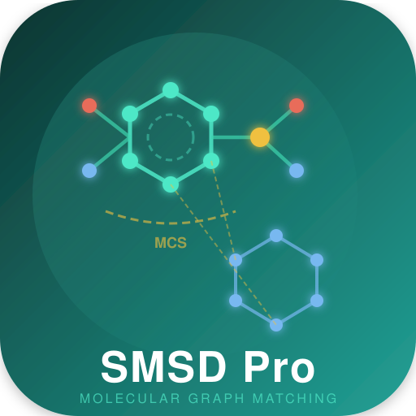

<p align="center">
  <a href="https://github.com/asad/SMSD" aria-label="SMSD Pro">
    
  </a>
</p>

<h1 align="center">SMSD Pro</h1>
<p align="center"><strong>Substructure &amp; MCS Search for Chemical Graphs</strong></p>

<p align="center">
  <a href="https://central.sonatype.com/artifact/com.bioinceptionlabs/smsd"></a>
  <a href="https://pypi.org/project/smsd/"></a>
  <a href="https://pypi.org/project/smsd/"></a>
  <a href="LICENSE"></a>
  <a href="https://github.com/asad/SMSD/releases"></a>
</p>

---

SMSD Pro provides substructure search and maximum common substructure
(MCS) search for chemical graphs. It is available for **Java**, **C++**
(header-only), and **Python**. Optional GPU paths are available for CUDA and
Apple Metal builds.

The proposed `7.2.0` update fixes element-preserving tautomer matching,
stereochemical traversal handling, weighted/bond objectives and symmetry
validation. Python wrappers preserve input indices and options; core batches
reuse native graphs. Java uses **CDK 2.13**. The published release remains
`7.1.2` on GitHub and `7.1.1` on Maven Central/PyPI until the new artifacts
are released.

### Local benchmark results

Performance depends on the corpus, chemistry constraints, search budget and
mapping validity. The current review compares source snapshot `6807f31`
(versioned 7.1.2) with the proposed 7.2.0 changes and RDKit 2026.09.1.
That snapshot includes changes made after the original 7.1.2 release tag.
See [measured results and reproduction commands](benchmarks/RESULTS_7.2.0.md).

The checked-in random and nearest-neighbor pairs are **Dalke-style datasets
derived from MoleculeNet**. They are not the original Dalke benchmark; the
nearest-neighbor file includes self-pairs, repeated pairs and low-similarity
pairs. SMSD and RDKit FMCS also differ in which query edges an MCS may omit.
The report separates timing, atom/bond counts, cancellations and validated
mapping witnesses; it does not establish a universal speed or quality winner.

Controlled local binding measurements show workload-specific tradeoffs:
cached RDKit conversion fell from 4.36 to 1.96 microseconds, the 32-target
substructure batch from 78.9 to 5.0 microseconds, and compiled SMARTS matching
on 32 repeated 448-atom targets from 5,807 to 78.4 microseconds. Small native
MCS dispatch increased from 17.1 to 21.4 microseconds. These measurements
exclude setup and are not application-wide speedups; the report records the
inputs, checksums and search timing regressions.

### Guides and References

| Document | Description |
|----------|-------------|
| **[Examples, How-To, and Cautions](docs/EXAMPLES.md)** | Worked examples for every feature with cautions and performance tips |
| [Python API Guide](docs/PYTHON.md) | Search, bindings and RDKit examples |
| [Java Guide](docs/JAVA.md) | Java API and CLI usage |
| [C++ Guide](docs/CPP.md) | Header-only C++ integration |
| [Release Notes](docs/RELEASE_NOTES.md) | What's new in this release |
| [How to Install](docs/HOWTO-INSTALL.md) | Installation and source builds |
| [Publishing](docs/PUBLISHING.md) | Local GitHub, PyPI and Maven Central release steps |
| [Changelog](CHANGELOG.md) | Full versioned change history |

### Molfile Support

V2000 and V3000 core graph round-trip, names/comments, SDF properties, charges,
isotopes, atom classes/maps, `R#` plus `M  RGP`, and basic stereo flags.

**Copyright (c) 2018-2026 Syed Asad Rahman — BioInception PVT LTD**

---

## Install

### Java (Maven)

```xml
<dependency>
  <groupId>com.bioinceptionlabs</groupId>
  <artifactId>smsd</artifactId>
  <version>7.1.1</version>
</dependency>
```

### Java (Download JAR)

```bash
curl -LO https://github.com/asad/SMSD/releases/download/v7.1.2/smsd-7.1.2-jar-with-dependencies.jar

java -jar smsd-7.1.2-jar-with-dependencies.jar \
  --Q SMI --q "c1ccccc1" --T SMI --t "c1ccc(O)cc1" --json -
```

### Python ([PyPI](https://pypi.org/project/smsd/))

```bash
pip install smsd
```

The source package declares CPython `3.9` or later. Existing PyPI releases
provide several platform wheels; availability varies by release and interpreter.
The proposed 7.2.0 release uses Python 3.14 wheels for Linux x86_64, macOS arm64
and Windows x86_64, plus a source distribution. Each platform must pass its
installed-wheel checks before publication. The search comparison uses Python
3.13.14 and RDKit 2026.09.1 on macOS arm64.
CPU execution is the default path. CUDA and Metal acceleration are optional.
RDKit and Open Babel are optional interop layers.

```python
import smsd

result = smsd.find_substructure("c1ccccc1", "c1ccc(O)cc1")
mcs    = smsd.find_mcs("c1ccccc1", "c1ccc2ccccc2c1")

# Tautomer-aware MCS
mcs    = smsd.find_mcs("CC(=O)C", "CC(O)=C", tautomer_aware=True)

# Prefer rare heteroatoms (S, P, Se) in MCS scoring
mcs    = smsd.find_mcs("C[S+](C)CCC(N)C(=O)O", "SCCC(N)C(=O)O",
                   prefer_rare_heteroatoms=True)

# Similarity upper bound (fast pre-filter)
sim    = smsd.similarity("c1ccccc1", "c1ccc(O)cc1")

fp     = smsd.fingerprint("c1ccccc1", kind="mcs")

# Circular fingerprint (ECFP4 equivalent)
ecfp4 = smsd.fingerprint_from_smiles("c1ccccc1", radius=2, fp_size=2048)
```

### Java API

```java
import com.bioinception.smsd.core.*;

SMSD smsd = new SMSD(mol1, mol2, new ChemOptions());
boolean isSub = smsd.isSubstructure();
var mcs = smsd.findMCS();

// CIP stereo assignment (Rules 1-5, including pseudoasymmetric r/s)
Map<Integer, Character> stereo = CIPAssigner.assignRS(g);
Map<Long, Character> ez = CIPAssigner.assignEZ(g);

// Batch MCS with non-overlap constraints
var mappings = SearchEngine.batchMCSConstrained(queries, targets, new ChemOptions(), 10_000);
```

### Python — Advanced Features

```python
import smsd

# --- Structured MCS Result ---
result = smsd.mcs_result("c1ccccc1", "c1ccc(O)cc1")
print(result.size)          # 6
print(result.overlapCoefficient)  # 0.857 (overlap coefficient)
print(result.mcs_smiles)    # "c1ccccc1"
print(result.mapping)       # {0: 0, 1: 1, ...}

# --- Works with any input type ---
# SMILES strings
mcs = smsd.find_mcs("c1ccccc1", "c1ccc(O)cc1")

# MolGraph objects (pre-parsed, avoids repeat parsing)
g1 = smsd.parse_smiles("c1ccccc1")
g2 = smsd.parse_smiles("c1ccc(O)cc1")
mcs = smsd.find_mcs(g1, g2)

# Native Mol objects (auto-detected, indices returned in native ordering)
# from rdkit import Chem
# mcs = smsd.find_mcs(Chem.MolFromSmiles("c1ccccc1"), Chem.MolFromSmiles("c1ccc(O)cc1"))

# --- Fingerprints ---
g = smsd.parse_smiles("c1ccccc1")
ecfp4  = smsd.circular_fingerprint(g, radius=2, fp_size=2048)
fcfp4  = smsd.circular_fingerprint(g, radius=2, fp_size=2048, mode="fcfp")
counts = smsd.circular_fingerprint_counts(g, radius=2, fp_size=2048)
torsion = smsd.topological_torsion("c1ccccc1", fp_size=2048)
tan    = smsd.overlap_coefficient(ecfp4, ecfp4)

# --- 2D Layout ---
g = smsd.parse_smiles("c1ccc2c(c1)cc1ccccc1c2")  # phenanthrene
coords = smsd.generate_coords_2d(g)
_, coords = smsd.force_directed_layout(g, coords, max_iter=500, target_bond_length=1.5)
_, coords = smsd.stress_majorisation(g, coords, max_iter=300)
crossings = smsd.reduce_crossings(g, coords, max_iter=2000)
```

### Python — MCS Variants & Batch Operations

```python
import smsd

# --- All MCS variants ---
mcs = smsd.find_mcs("c1ccccc1", "c1ccc(O)cc1")                     # Connected MCS (default)
mcs = smsd.find_mcs("c1ccccc1", "c1ccc(O)cc1", connected_only=False) # Disconnected MCS
mcs = smsd.find_mcs("c1ccccc1", "c1ccc(O)cc1", induced=True)         # Induced MCS
mcs = smsd.find_mcs("c1ccccc1", "c1ccc(O)cc1", maximize_bonds=True)  # Edge MCS (MCES)

# Find top-N distinct MCS solutions
all_mcs = smsd.find_mcs("c1ccccc1", "c1ccc(O)cc1", max_results=5)

# SMARTS-based MCS
mcs = smsd.find_mcs_smarts("[#6]~[#7]", "c1ccc(N)cc1")

# Scaffold MCS (Murcko framework)
scaffold = smsd.find_scaffold_mcs(
    smsd.parse_smiles("CC(=O)Oc1ccccc1C(=O)O"),
    smsd.parse_smiles("Oc1ccccc1C(=O)O")
)

# R-group decomposition
rgroups = smsd.decompose_r_groups("c1ccccc1", ["c1ccc(O)cc1", "c1ccc(N)cc1"])

# --- Substructure Search ---
hit = smsd.find_substructure("c1ccccc1", "c1ccc(O)cc1")
all_matches = smsd.find_substructure("c1ccccc1", "c1ccc(O)cc1", max_results=10)

# SMARTS pattern matching
matches = smsd.smarts_match("[OH]", smsd.parse_smiles("c1ccc(O)cc1"))

# --- Similarity & Screening ---
sim = smsd.overlap_coefficient(
    smsd.circular_fingerprint(smsd.parse_smiles("CCO"), radius=2),
    smsd.circular_fingerprint(smsd.parse_smiles("CCCO"), radius=2)
)
dice = smsd.dice(
    smsd.circular_fingerprint_counts(smsd.parse_smiles("CCO"), radius=2),
    smsd.circular_fingerprint_counts(smsd.parse_smiles("CCCO"), radius=2)
)

# --- Chemistry Options ---
# Tautomer-aware with solvent and pH
mcs = smsd.find_mcs("CC(=O)C", "CC(O)=C", tautomer_aware=True)

# Loose bond matching (FMCS-style)
mcs = smsd.find_mcs("c1ccccc1", "C1CCCCC1", match_bond_order="loose")

# --- Canonical SMILES ---
# v7.1.1: canonical_smiles() and to_smiles() accept a SMILES string OR a MolGraph.
# Output is byte-identical across the Java, C++, and Python engines.
smi = smsd.canonical_smiles("OC(=O)c1ccccc1")                 # from SMILES string
smi = smsd.to_smiles(smsd.parse_smiles("OC(=O)c1ccccc1"))     # from MolGraph
mcs_smi = smsd.mcs_to_smiles(g1, mapping)                     # extract MCS as SMILES

# --- CIP Stereo Assignment ---
g = smsd.parse_smiles("N[C@@H](C)C(=O)O")  # L-alanine
stereo = smsd.assign_rs(g)                   # {1: 'S'}
ez = smsd.assign_ez(smsd.parse_smiles("C/C=C/C"))  # E-2-butene

# --- Native MolGraph I/O ---
g = smsd.parse_smiles("c1ccccc1")
g = smsd.read_molfile("molecule.mol")
mol_block = smsd.write_mol_block(g)
v3000 = smsd.write_mol_block_v3000(g)
smsd.write_molfile(g, "molecule_out.mol", v3000=True)
smsd.export_sdf([g1, g2], "output.sdf")
```

### SVG Depiction

Zero-dependency SVG renderer — the same specification used by Nature, Science,
JACS, and Springer journals. See [Examples](docs/EXAMPLES.md#7-depiction-svg)
for full usage guide.

```python
import smsd

# Render any molecule as SVG
svg = smsd.depict_svg("CC(=O)Oc1ccccc1C(=O)O")  # aspirin
smsd.save_svg(svg, "aspirin.svg")

# MCS comparison — side-by-side with highlighted matching atoms
mol1 = smsd.parse_smiles("c1ccccc1")
mol2 = smsd.parse_smiles("c1ccc(O)cc1")
mapping = smsd.find_mcs(mol1, mol2)
svg = smsd.depict_pair(mol1, mol2, mapping)
smsd.save_svg(svg, "mcs_comparison.svg")

# Substructure highlighting
svg = smsd.depict_mapping(mol2, mapping)

# Custom styling (all ACS proportions auto-scale from bond_length)
svg = smsd.depict_svg("Cn1cnc2c1c(=O)n(c(=O)n2C)C",  # caffeine
    bond_length=50, width=600, height=400)

# Export to SDF file
mols = [smsd.parse_smiles(s) for s in ["CCO", "c1ccccc1", "CC(=O)O"]]
smsd.export_sdf(mols, "output.sdf")
```

Features: skeletal formula, Jmol/CPK element colors, asymmetric double bonds,
wedge/dash stereo, H-count subscripts, charge superscripts, bond-to-label
clipping, aromatic inner circles, atom map numbers.

### C++ (Header-Only)

```bash
git clone https://github.com/asad/SMSD.git
# Add SMSD/cpp/include to your include path — no other dependencies needed
```

```cpp
#include "smsd/smsd.hpp"

auto mol1 = smsd::parseSMILES("c1ccccc1");
auto mol2 = smsd::parseSMILES("c1ccc(O)cc1");

bool isSub = smsd::isSubstructure(mol1, mol2, smsd::ChemOptions{});
auto mcs   = smsd::findMCS(mol1, mol2, smsd::ChemOptions{}, smsd::MCSOptions{});

// Batch MCS with non-overlap constraints
auto mappings = smsd::batchMCSConstrained(queries, targets, smsd::ChemOptions{});
```

### Build from Source

```bash
git clone https://github.com/asad/SMSD.git
cd SMSD

# Java
mvn -U clean package

# C++
mkdir cpp/build && cd cpp/build
cmake .. -DCMAKE_BUILD_TYPE=Release
make -j$(nproc)

# Python
pip install -e .  # from the repository root
```

### Docker

```bash
docker build -t smsd .
docker run --rm smsd --Q SMI --q "c1ccccc1" --T SMI --t "c1ccc(O)cc1" --json -
```

---

## Benchmarks

The [7.2.0 benchmark report](benchmarks/RESULTS_7.2.0.md) records the current
local runs, versions, budgets and mapping checks. Historical result files are
retained for reference; they are not evidence for current performance claims.

The [benchmark guide](benchmarks/README.md) provides commands for the Python,
Java and native C++ programs. CPU timing comparisons exclude incompatible or
invalid mapping witnesses and report canceled RDKit searches separately.
SMSD's public mapping API does not currently expose an optimality certificate
or a cancellation flag, so completion cannot be inferred from elapsed time.

### External Benchmark Datasets

Checked-in datasets used by the local evaluation, stored in [`benchmarks/data/`](benchmarks/data/):

| Dataset | Pairs/Patterns | Source | Purpose |
|---------|---------------|--------|---------|
| Tautobase (Chodera subset) | 468 tautomer pairs | [Wahl & Sander 2020](https://doi.org/10.1021/acs.jcim.0c00035) | Tautomer-aware MCS validation |
| Tautobase (full SMIRKS) | 1,680 pairs | [Wahl & Sander 2020](https://doi.org/10.1021/acs.jcim.0c00035) | Tautomer transform coverage |
| Ehrlich-Rarey SMARTS v2.0 | 1,400 patterns | [Ehrlich & Rarey 2012](https://doi.org/10.1186/1758-2946-4-13) | Substructure search validation |
| Dalke-style random pairs | 1,000 pairs | MoleculeNet drug collections | Random-pair MCS evaluation |
| Dalke-style NN pairs | 1,000 pairs | MoleculeNet drug collections | Nearest-neighbor sample, including self-pairs and repeats |
| Stress pairs | 12 curated pairs | Repository fixtures | Budget and robustness checks |
| Molecule pool | 5,590 SMILES | MoleculeNet (BBBP, SIDER, ClinTox, BACE) | Pair generation source |

```bash
# Run bounded external diagnostics (Java)
mvn -B -Dslow.tests.exclude=nothing \
  '-Dtest=BenchmarkSuiteTest*,ExternalBenchmarkTest*,JavaCdkVsSmsdBenchmarkTest' \
  -Dbenchmark=true -Dsmsd.benchmark.timeoutMs=1000 \
  -Dsmsd.benchmark.rounds=1 -Dsmsd.benchmark.warmup=0 \
  -Dsmsd.benchmark.outputDir=build/local-benchmarks/java test

# Run external benchmarks (Python)
SMSD_BENCHMARK=1 python -m pytest python/tests/test_external_benchmarks.py \
  --import-mode=importlib -v -s

# Regenerate Dalke-style pairs (requires RDKit)
python benchmarks/generate_dalke_pairs.py
```

---

## Algorithms

### MCS Engine

SMSD Pro ships an **adaptive multi-strategy MCS engine** that selects
the best technique for each input pair.  Implementation details are
subject to change between minor releases.

Public algorithmic foundations the engine builds on (citations only,
not the SMSD pipeline itself):

| Foundation | Reference |
|---|---|
| Partition-refinement clique search | McCreesh, Prosser & Trimble, *J. Artif. Intell. Res.* 2017 |
| Edge-growth backtracking | McGregor, *Software: Practice & Experience* 1982 |
| Maximum-clique enumeration | Bron & Kerbosch, *Comm. ACM* 1973; Tomita et al. 2006 |
| Subgraph isomorphism (VF2++) | Juttner & Madarasi, *Discrete Appl. Math.* 2018 |
| Ring perception | Vismara, *J. Chem. Inf. Comput. Sci.* 1997 |

### MCS Variants

| Variant | Flag |
|---|---|
| MCIS (induced) | `induced=true` |
| MCCS (connected) | default |
| MCES (edge subgraph) | `maximizeBonds=true` |
| dMCS (disconnected) | `disconnectedMCS=true` |
| N-MCS (multi-molecule) | `findNMCS()` |
| Weighted MCS | `atomWeights` |
| Scaffold MCS | `findScaffoldMCS()` |
| Tautomer-aware MCS | `ChemOptions.tautomerProfile()` |

### Substructure Search (VF2++)

VF2++ (Juttner & Madarasi 2018) matcher with optional GPU-accelerated
domain initialization (CUDA + Metal).  Implementation details are
subject to change between minor releases.

### Ring Perception

Horton's candidate generation + 2-phase GF(2) elimination (Vismara 1997) for relevant cycles, orbit-based grouping for Unique Ring Families (URFs).

| Output | Description |
|---|---|
| SSSR / MCB | Smallest Set of Smallest Rings |
| RCB | Relevant Cycle Basis |
| URF | Unique Ring Families (automorphism orbit grouping) |

---

## Chemistry Options

| Option | Values |
|---|---|
| Chirality | R/S tetrahedral, E/Z double bond |
| Isotope | `matchIsotope=true` |
| Tautomers | 30 transforms with pKa-informed weights (Sitzmann 2010, Dhaked & Nicklaus 2024) |
| Solvent | AQUEOUS, DMSO, METHANOL, CHLOROFORM, ACETONITRILE, DIETHYL_ETHER |
| Ring fusion | IGNORE / PERMISSIVE / STRICT |
| Bond order | STRICT / LOOSE / ANY |
| Aromaticity | STRICT / FLEXIBLE |
| Lenient SMILES | `ParseOptions{.lenient=true}` (C++) / `ChemOptions.lenientSmiles` (Java) |

**Preset profiles**: `ChemOptions()` (default), `.tautomerProfile()`, `.fmcsProfile()`

With the default chemistry profile, `ringMatchesRingOnly=true` enforces ring/non-ring
parity for matched atoms and bonds in both directions. Use `.fmcsProfile()` when you
explicitly want loose FMCS-style topology where ring atoms may map to chain atoms and
partial ring fragments are accepted.

**Solvent-aware tautomers** (Tier 2 pKa): `opts.withSolvent(Solvent.DMSO)` adjusts tautomer equilibrium weights for non-aqueous environments.

---

## Platform & GPU Support

| Platform | CPU | GPU |
|---|---|---|
| macOS (Apple Silicon) | OpenMP | Metal (shared buffers) |
| Linux | OpenMP | CUDA |
| Windows | OpenMP | CUDA |
| Any (no GPU) | OpenMP | Automatic CPU fallback |

GPU acceleration covers RASCAL batch screening, Tanimoto clustering, and substructure domain initialization. Recursive matching runs on CPU. Dispatch: `CUDA -> Metal -> OpenMP -> sequential`.

### Performance Caching

SMSD employs multi-level caching to eliminate redundant computation in batch and reaction workloads:

| Cache | Target | Benefit |
|---|---|---|
| MolGraph identity cache | Molecule object conversion | Same molecule reused across 6-18 calls per reaction pair |
| Domain space cache | VF2++ atom compatibility matrix | Avoids O(Nq*Nt) rebuild on repeated queries |
| ECFP/FCFP fingerprint cache | Default-parameter fingerprints | Reuses cached results for repeated calls |
| Pharmacophore features cache | FCFP atom invariants | Eliminates O(n*degree^2) per FCFP call |
| C++ GraphBuilder compat matrix | All MCS strategies | Pre-computed once, shared across algorithms |

Call `SearchEngine.clearMolGraphCache()` (Java) or reuse `MolGraph` instances (C++/Python) between batches.

---

## Additional Tools

| Tool | Description |
|---|---|
| **CIP R/S/E/Z assignment** | Full digraph-based stereo descriptors (IUPAC 2013 Rules 1-5) including Rule 3 (Z > E), like/unlike pairing, and pseudoasymmetric r/s |
| Circular fingerprint (ECFP/FCFP) | Tautomer-aware Morgan/ECFP with configurable radius (-1 = whole molecule) |
| Count-based ECFP/FCFP | `ecfpCounts()` / `fcfpCounts()` — retain feature multiplicities |
| Topological Torsion fingerprint | 4-atom path with atom typing (path descriptor) |
| Path fingerprint | Graph-aware, tautomer-invariant path enumeration |
| MCS fingerprint | MCS-aware, auto-sized |
| Similarity metrics | Tanimoto, Dice, Cosine, Soergel (binary + count-vector) |
| Fingerprint formats | `toBitSet()`, `toHex()`, `toBinaryString()`, `fromBitSet()`, `fromHex()` |
| **MCS SMILES extraction** | `findMCSSmiles()` — extract MCS as canonical SMILES |
| **findAllMCS** | Bounded enumeration; symmetry deduplication requires complete generators |
| **SMARTS-based MCS** | `findMCSSmarts()` — largest substructure matching a SMARTS pattern |
| R-group decomposition | `decomposeRGroups()` |
| **MatchResult** | Structured result: size, mapping, overlap coefficient, query/target atom counts |
| RASCAL screening | O(V+E) similarity upper bound |
| Canonical SMILES / SMARTS | deterministic, toolkit-independent (including `X` total connectivity) |
| **SVG depiction** | Renderer with ACS-style defaults: skeletal formulas, Jmol colors, stereo wedges, MCS highlighting, side-by-side pair rendering |
| Lenient SMILES parser | Best-effort recovery from malformed SMILES |
| N-MCS | Multi-molecule MCS with provenance tracking |
| Tautomer validation | `validateTautomerConsistency()` — proton conservation check |
| 30 tautomer transforms | pKa-informed weights, 6 solvents, pH-sensitive, ring-chain tautomerism |
| **8-phase 2D layout pipeline** | Template match, ring-first, chain zig-zag, force-directed, overlap resolution, crossing reduction, canonical orientation, bond normalisation |
| **Distance geometry 3D** | Bounds matrix, double-centering, power iteration, force-field refinement |
| **40+ scaffold templates** | Pharmaceutical scaffolds, PAH, spiro, bridged (norbornane, adamantane) |
| **Coordinate transforms** | translate, rotate, scale, mirror, center, align, bounding box, RMSD |
| **Force-directed layout** | `forceDirectedLayout()` for bond-crossing minimisation |
| **SMACOF stress majorisation** | `stressMajorisation()` to reduce embedding stress |
| **Batch constrained MCS** | `batchMCSConstrained()` multi-pair MCS with non-overlap atom exclusion |
| **Two-phase crossing reduction** | `reduceCrossings()` Phase 1: system-level flipping, Phase 2: individual ring flipping with fusion-atom pivots |
| **computeSSSR / layoutSSSR** | Clean SSSR APIs: minimum cycle basis and layout-ordered ring perception |

---

## File Formats

| Format | Read | Write |
|---|---|---|
| SMILES | Java, C++ | Java, C++ |
| SMARTS | Java, C++ | C++ |
| MOL V2000 | Java, C++ | C++ |
| SDF | Java, C++ | — |
| Mol2, PDB, CML | Java | — |

---

## Release Downloads

The proposed 7.2.0 asset set contains portable Java 25 library/CLI packages,
C++17 headers, CPython 3.14 wheels for three operating systems and a source
distribution. The Java packages run on Linux, macOS and Windows with JDK 25
installed. Hosted release workflows remain manual. See
[publishing steps](docs/PUBLISHING.md); existing GitHub downloads remain at
7.1.2 until the new release is published.

| Download | Description |
|----------|-------------|
| `smsd-7.2.0.jar` | Java library JAR |
| `smsd-7.2.0-jar-with-dependencies.jar` | Standalone CLI (Java 25+) |
| `smsd-7.2.0-sources.jar`, `smsd-7.2.0-javadoc.jar` | Java sources and API documentation |
| `smsd-7.2.0-cli.tar.gz` | Java launcher distribution for Linux, macOS and Windows (bin/ and repo/) |
| `smsd-cpp-7.2.0-headers.tar.gz` | C++17 headers with LICENSE and NOTICE |
| `smsd-7.2.0.tar.gz` | Python source distribution |
| `smsd-7.2.0-cp314-cp314-manylinux*.whl` | Python 3.14, Linux x86_64 with glibc 2.28+ |
| `smsd-7.2.0-cp314-cp314-macosx_26_0_arm64.whl` | Python 3.14, Apple Silicon, macOS 26+ |
| `smsd-7.2.0-cp314-cp314-win_amd64.whl` | Python 3.14, Windows x86_64 |
| `SHA256SUMS` | Checksums for the release assets |

These are release targets; current execution evidence is recorded in
[validation](docs/VALIDATION_7.2.0.md). Other architectures, including Intel
macOS and Linux arm64, can build from source and are outside this wheel set.

```bash
# CLI
java -jar smsd-7.2.0-jar-with-dependencies.jar --Q SMI --q "c1ccccc1" --T SMI --t "c1ccc(O)cc1" --json -

# Docker CLI
docker build -t smsd .
docker run --rm smsd --Q SMI --q "c1ccccc1" --T SMI --t "c1ccc(O)cc1" --json -

# Python — build from the downloaded source distribution
pip install ./smsd-7.2.0.tar.gz
```

---

## Tests

Current 7.2.0 local validation on macOS arm64:

| Suite | Result | Scope |
|---|---|---|
| Java | 1,242 passed; 15 opt-in cases skipped | Clean verification, CLI, sources and Javadoc artifacts |
| C++ CPU | All 12 suites passed with assertions enabled | Search, parsing, chemistry, batch, assignment, matching and portability |
| Selected Metal regressions | All 3 selected suites passed | Batch and matching-domain checks on local hardware |
| Python | 691 passed; 8 optional/opt-in cases skipped in each environment | Installed CPU wheels: Python 3.13.14/RDKit 2026.09.1 and Python 3.14.8/RDKit 2026.03.6 |
| Independent native oracles | 84,096 cases passed | Small graph objectives, fragments, McSplit/clique and enumeration |
| Native recursion state | 1,024 additional cases passed | Connected/disconnected McGregor assignment and undo validity |
| ASan/UBSan | Focused checks passed | Coverage validity, stereo, bounds, deadlines and optional arrays |

The Python guide's executable snippets also passed. Full corpus and optional
benchmark executions are reported separately in the
[benchmark report](benchmarks/RESULTS_7.2.0.md). These checks establish the
reported test coverage, rather than a guarantee for every molecule, objective
or platform. The Linux x86_64 release checks pass all 12 native suites and
691 Python tests with 8 skips under local emulation. The Windows x86_64 build
passes the same suites and Python test counts on Windows Server 2022 with
MSVC and CPython 3.14.7. CUDA remains untested.
Corrected Windows runtime packaging still requires a validation rerun before release.
See [current validation](docs/VALIDATION_7.2.0.md); the
[7.1.2 record](docs/VALIDATION_7.1.2.md) is historical.

---

## Documentation

| Document | Description |
|---|---|
| **[Examples, How-To, and Cautions](docs/EXAMPLES.md)** | Worked examples for every feature with cautions and performance tips |
| [Python API Guide](docs/PYTHON.md) | Search, bindings and RDKit examples |
| [Java Guide](docs/JAVA.md) | Java API and CLI usage |
| [C++ Guide](docs/CPP.md) | Header-only C++ integration |
| [Release Notes](docs/RELEASE_NOTES.md) | Current release |
| [Changelog](CHANGELOG.md) | Full versioned change history |
| [How to Install](docs/HOWTO-INSTALL.md) | Installation and source builds |
| [NOTICE](NOTICE) | Attribution, trademark, and novel algorithm terms |

---

## License and Commercial Use

SMSD Pro is released under the **Apache License 2.0** — free for any use,
including commercial, with no fee, registration, or approval required.

| Use Case | Permitted |
|----------|-----------|
| Commercial products and services | Yes |
| Proprietary / closed-source software | Yes |
| SaaS platforms and cloud services | Yes |
| Pharmaceutical, biotech, agrochemical pipelines | Yes |
| Academic research and teaching | Yes |
| Internal corporate tools | Yes |
| Modify and redistribute | Yes |

**What you must do** (Apache 2.0 Section 4): include the [LICENSE](LICENSE) and
[NOTICE](NOTICE) files in your distribution, retain copyright notices, and state
any changes you made to source files.

**What you must not do**: use "SMSD", "SMSD Pro", or BioInception trademarks to
endorse your product without permission (see [NOTICE](NOTICE) for trademark terms).

Full details: [LICENSE](LICENSE) | [NOTICE](NOTICE)

---

## Citation

If you use SMSD Pro in your research, please cite the following paper describing
the tautomer-aware MCS engine:

> Rahman SA.
> *SMSD Pro: Tautomer-Aware Maximum Common Substructure Search.*
> ChemRxiv, 2025.
> DOI: [10.26434/chemrxiv.15001534](https://doi.org/10.26434/chemrxiv.15001534/v1)

For the original SMSD toolkit, please also cite:

> Rahman SA, Bashton M, Holliday GL, Schrader R, Thornton JM.
> *Small Molecule Subgraph Detector (SMSD) toolkit.*
> Journal of Cheminformatics, 1:12, 2009.
> DOI: [10.1186/1758-2946-1-12](https://doi.org/10.1186/1758-2946-1-12)

GitHub renders a **"Cite this repository"** button from [CITATION.cff](CITATION.cff).

---

## Author

**Syed Asad Rahman** — [BioInception PVT LTD](https://github.com/asad)

Copyright (c) 2018-2026 BioInception PVT LTD. Algorithm Copyright (c) 2009-2026 Syed Asad Rahman.

## License

Apache License 2.0 — see [LICENSE](LICENSE) and [NOTICE](NOTICE)

SMSD Pro is developed at BioInception and distributed under Apache License 2.0.
Commercial use and redistribution are allowed, subject to the license and
notice requirements.
